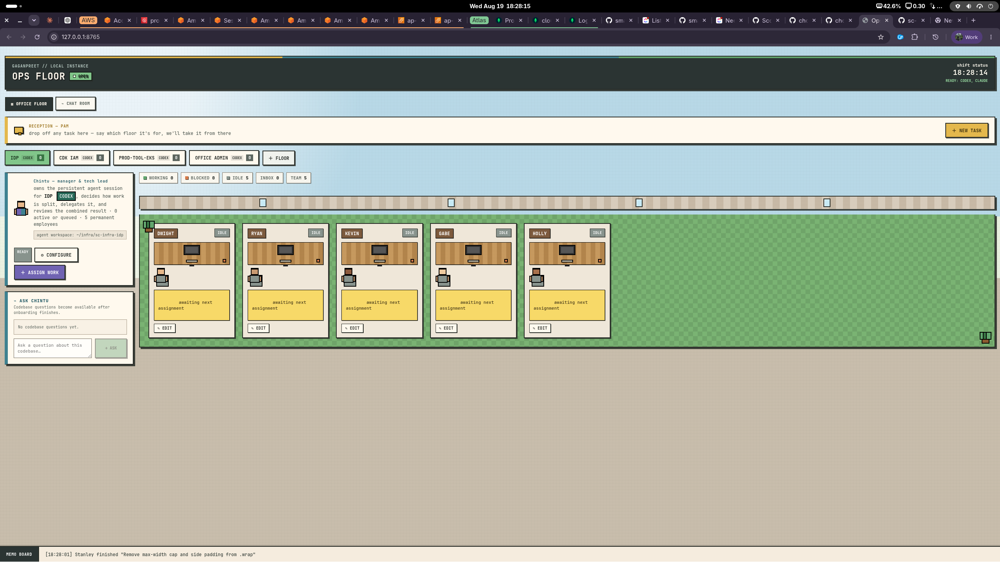

# the office

the office is a local-first browser interface for coordinating coding work through the Claude Code and Codex CLIs. Each repository is represented as a floor with a user-named Manager & Tech Lead, a persistent agent session, and a permanent team of five employees.

The application runs entirely on your computer. The Python server listens only on `127.0.0.1`, launches your locally installed agent CLIs, and gives them access to repositories you explicitly onboard.



## Features

- Choose Claude or Codex independently for each floor.
- Onboard an existing local Git repository with the built-in folder browser.
- Build a floor from a non-Git folder that has multiple Git repository "cupboards."
- Clone a Git repository into a selected local directory.
- Build repository context before accepting implementation work.
- Index architecture, conventions, tests, risks, and key files separately for every cupboard during onboarding.
- Keep one persistent Manager & Tech Lead session per floor.
- Give every floor a stable team of five named employees who are reused across tasks.
- Let reception analyze an incoming task and route scoped work to every repository floor it requires.
- Let each lead analyze its routed work and decide whether it needs one worker or multiple workers.
- Let floor leads make targeted, read-only consultation calls to other floors before finalizing a plan.
- Give floor questions and reports read-only access to the context and repositories of other onboarded floors when explicitly needed.
- Queue reception, inter-floor calls, and floor assignments durably while shared lead sessions are busy.
- Delegate multi-worker work through the CLI's native subagent support.
- Return workers to the available pool as soon as implementation finishes.
- View human-readable, live CLI activity by clicking a profile or worker.
- See live employee phases such as reading code, editing files, running tests, building, reviewing, and coordinating delegated work.
- See the five most recent completion times and their average on every floor.
- Ask the floor lead questions about the onboarded codebase.
- Request read-only implementation reports researched by one available employee.
- Use the separate Chat Room for ordinary Claude or Codex conversations.
- Review combined changes before publishing.
- Push a branch and create a GitHub pull request only after explicit confirmation.
- Detect manually pushed work across all floors and hide stale publish controls.
- Store floors, chat history, session IDs, and office state in browser `localStorage`.

## Requirements

- Python 3.10 or newer
- Git
- At least one supported local agent CLI:
  - Claude Code, authenticated with the user's local Claude account or a valid API key
  - Codex CLI, authenticated locally
- A modern browser
- GitHub CLI (`gh`) authenticated with GitHub, only if you want the office to create pull requests

There are no third-party Python packages. `requirements.txt` is intentionally empty apart from explanatory comments.

Verify the tools you intend to use:

```sh
python3 --version
git --version
claude --version
codex --version
gh --version
```

the office also searches common user installation locations such as `~/.local/bin`, npm global bins, Volta, Bun, and installed NVM versions.

## Installation

Clone or copy this directory, then optionally create a virtual environment:

```sh
cd /path/to/office
python3 -m venv .venv
. .venv/bin/activate
python3 -m pip install -r requirements.txt
```

No pip packages will be installed; the virtual environment simply gives the server an isolated Python runtime.

## Running

Start the local service:

```sh
python3 office_server.py
```

Open:

```text
http://127.0.0.1:8765
```

Use another port if necessary:

```sh
python3 office_server.py --port 9000
```

Do not open `office.html` directly as a `file://` page. Agent execution, logs, repository browsing, Git checks, cloning, and publishing require the Python service.

## CLI configuration

If an agent executable is not discoverable automatically, provide its absolute path before starting the server:

```sh
export TASK_OFFICE_CODEX_BIN=/absolute/path/to/codex
export TASK_OFFICE_CLAUDE_BIN=/absolute/path/to/claude
python3 office_server.py
```

The server prints the detected Claude and Codex paths at startup.

Claude normally uses the authentication available to the local CLI. If an inherited `ANTHROPIC_API_KEY` is rejected, the office retries once using the user's local Claude login. Codex Chat Room sessions are allowed to run from the non-Git application directory and remain read-only.

## Creating a floor

1. Select **+ floor**.
2. Enter a repository/floor name.
3. Choose Claude or Codex.
4. Enter the Manager & Tech Lead's display name. The supplied name is used throughout the interface and activity history.
5. Choose one repository setup:
   - **Existing repository:** browse to a local folder containing `.git`.
   - **Folder with cupboards:** choose **This folder has cupboards**, then select a folder that may not itself be a Git repository. The office discovers Git repositories beneath it.
   - **Clone repository:** enter a Git URL and choose the parent destination folder.
6. Save the floor.

The selected agent first performs a read-only onboarding run. For an ordinary floor it records one repository context. For a cupboard floor it iterates over every discovered Git repository and records a path-keyed context entry containing architecture, conventions, test commands, risk areas, and important files, plus a floor-wide summary of how the cupboards relate. Useful non-Git files at the selected root are shared read-only context. Tasks remain unavailable until onboarding succeeds.

## Work lifecycle

```text
User task at reception
   ↓
Reception analyzes repository ownership
   ↓
One or more persistent floor inboxes
   ↓
Manager & Tech Lead analyzes the task
   ↓
Optional read-only calls to other floor leads
   ↓
Single-worker or multi-worker decision
   ↓
Worker delegation inside the shared floor session
   ↓
Worker desks return to the available pool
   ↓
Combined diff and test review across every changed cupboard
   ↓
User chooses whether to publish
   ↓
One task branch per changed repository, followed by one GitHub pull request per repository
```

The Manager & Tech Lead coordinates and reviews; it does not take implementation work directly. For multi-worker tasks, it assigns distinct workstreams, waits for the workers, and reviews their combined result.

Pam first compares each reception task with the onboarded summaries for all configured floors. She can create one scoped route or several cross-repository routes, and each route enters the corresponding floor's persistent inbox. The floor assignment form still sends work directly to the currently open floor.

During planning, a lead can request targeted knowledge from another onboarded floor. The receiving lead answers in its own persistent session using read-only repository access. The originating lead waits for those calls, adds their structured answers to its context, and then finalizes the worker plan. Calls are limited to one consultation round per floor request so floors cannot loop indefinitely.

Each lead also receives a directory of the other onboarded floors, including their names, repository paths, onboarding summaries, and architecture. When a task explicitly asks for a detail or context from another floor, the lead must call that floor unless the exact information is already available in the directory. Read-only questions and reports may inspect another floor directly when needed. Implementation remains repository-owned: another floor is context-only unless reception routed an implementation workstream to it.

If a lead session is already planning, consulting, orchestrating, reviewing, answering a question, or recovering after a refresh, new work stays visibly queued and is dispatched in order when the session becomes available. Worker desks are released after implementation completes; user approval, merging, and publishing do not keep them occupied.

Each floor keeps a browser-persisted history of its 20 most recent approved tasks and shows the latest five with their average. Elapsed time starts when the Manager & Tech Lead first begins analyzing the task and ends when the combined change review is approved; time waiting in the floor inbox and time waiting for publication are excluded. Existing retained task trackers are backfilled where possible and marked as approximate in the row tooltip when their older timestamps are less precise.

Employees on a floor collaborate in the same workspace rather than using separate employee branches. Each workstream declares the cupboard paths it owns. Nothing is pushed automatically. After combined review, the publish action shows the changed cupboards and asks for both a task-specific source branch and the destination branch, then asks once for confirmation. The local service creates the source branch independently in every changed repository, stages and commits each repository, pushes each branch, and invokes `gh pr create --base <destination-branch>` once per repository. If a changed cupboard was omitted from the manager's review, publishing stops instead of silently including or ignoring it.

## Repository push detection

For every floor with an approved review, the office checks whether the current work has already been pushed. It considers:

- working-tree changes;
- commits ahead of the configured upstream;
- local remote-tracking branches containing `HEAD`; and
- the matching branch on `origin` when local tracking metadata is missing.

Checks refresh every 30 seconds. Once a clean current commit is confirmed on a remote branch, the stale review/publish control is hidden. This also covers branches pushed manually without `git push -u`.

## Chat and codebase questions

The **Chat Room** is separate from the office floors. Choose Claude or Codex and use it as a plain conversational assistant. Chat Room prompts prohibit repository edits and external actions.

Each floor also has an **Ask _name_** section. Those answers come from the persistent floor session and include the repository context gathered during onboarding. You can name another onboarded floor to use its context or inspect its repository in read-only mode. Questions are read-only and cannot be asked while the lead is handling another turn.

## Reports

Open **Reports** from a floor's Manager & Tech Lead card to ask how a feature, migration, integration, or architectural change should be implemented. The request stays attached to that floor and waits for one permanent employee to become available.

The lead assigns exactly one employee to investigate the onboarded repository in read-only mode. The completed report includes:

- an executive summary;
- a recommended approach;
- ordered implementation steps;
- risks and tradeoffs; and
- relevant repository files.

Report work runs in that employee's independent Claude or Codex session, so the tech lead can continue analyzing and assigning normal floor work at the same time. It appears on the employee's desk and in the live activity log. The employee is returned to the available pool immediately after the report completes. Reports remain in the floor's local history and their summaries become part of the shared floor context for later questions and tasks.

## Logs

Click the Manager & Tech Lead or a worker profile to see the actual local CLI activity for its shared session. Logs are rendered in a concise human-readable format by default; raw JSON remains available from the log toolbar for debugging.

Employee desks also show the latest activity inferred from structured Claude/Codex events. File-write tools appear as **Editing code**, common test commands appear as **Running tests**, and read, build, review, delegation, and command activity use their own labels and colors. When a CLI exposes only the shared orchestration session rather than individual subagent identities, assigned employees display that shared session's currently observed phase.

The server holds live process output in memory, with up to 5,000 entries per profile. Restarting the server clears those in-memory logs, although browser-persisted floor and session metadata remains available.

## Persistence

Office configuration and conversation state are stored under the browser origin in `localStorage`. This includes:

- floor and repository configuration;
- selected agent and lead name;
- worker/task state;
- onboarding and review context;
- Claude/Codex session IDs; and
- Chat Room history.

Use the same browser profile and server address to retain state. Changing the port creates a different browser origin and therefore a different `localStorage` namespace. Clearing site data removes the saved office state but does not modify any repository.

## Troubleshooting

### The page says the local agent service is offline

Run `python3 office_server.py` and open the printed HTTP address. Do not use the HTML file directly.

### Claude or Codex is not found

Confirm the CLI runs in a terminal. If it is installed in a nonstandard location, set `TASK_OFFICE_CLAUDE_BIN` or `TASK_OFFICE_CODEX_BIN` to the absolute executable path before starting the server.

### Claude reports an invalid API key

An `ANTHROPIC_API_KEY` in the server environment may override the user's Claude login. The office automatically retries rejected keys with the local login. You can also remove the stale variable before startup:

```sh
unset ANTHROPIC_API_KEY
python3 office_server.py
```

### Codex says the directory is not trusted or is not a Git repository

Restart the current version of `office_server.py`. Chat Room runs include Codex's non-Git-directory override; repository floors still operate inside their configured Git repository.

### Folder selection does not open a native dialog

Use the built-in folder browser in the floor form. It does not require `zenity`, `kdialog`, or Tkinter. The server retains native-picker support as an optional fallback where one of those tools is available.

### A manually pushed branch still shows a publish button

Wait up to 30 seconds and refresh the page. Confirm that the working tree is clean and that the current commit exists on the corresponding branch on `origin`. Restart the Python server after updating its code so the repository-state endpoint is available.

### Pull-request creation fails

Verify that:

```sh
gh auth status
git remote -v
```

The repository must have an `origin` remote that the current user can push to, and `gh` must be authenticated for that GitHub host.

### The UI only shows a generic failure

New runs return a concise failure reason directly in chat. Click the relevant profile to inspect the complete local CLI log when more detail is needed.

## Security and deployment model

The office is designed as a personal local application, not a public web service:

- It binds to `127.0.0.1` and has no user authentication.
- Agent processes inherit the local user's filesystem permissions and selected CLI environment.
- Implementation agents may edit files in onboarded repositories.
- Publishing can stage all current repository changes and push them after confirmation.
- Browser state may contain repository paths, prompts, task descriptions, and session IDs.

Do not expose the server directly to a LAN or the public internet. A multi-user deployment would require authentication, authorization, per-user process isolation, encrypted server-side persistence, CSRF protection, audit controls, and strict repository access boundaries.

## Project structure

```text
office.html       Single-page interface, office state, and workflow orchestration
office_server.py  Local HTTP service, CLI execution, Git operations, and logs
requirements.txt Python dependency declaration (standard library only)
README.md         Setup and operating documentation
.gitignore        Local Python, editor, secret, log, and OS exclusions
assets/           Screenshots and other README media
```

## Stopping the server

Press `Ctrl+C` in the terminal running `office_server.py`. Active child-agent work should be allowed to finish or stopped from the relevant profile before shutting down.
