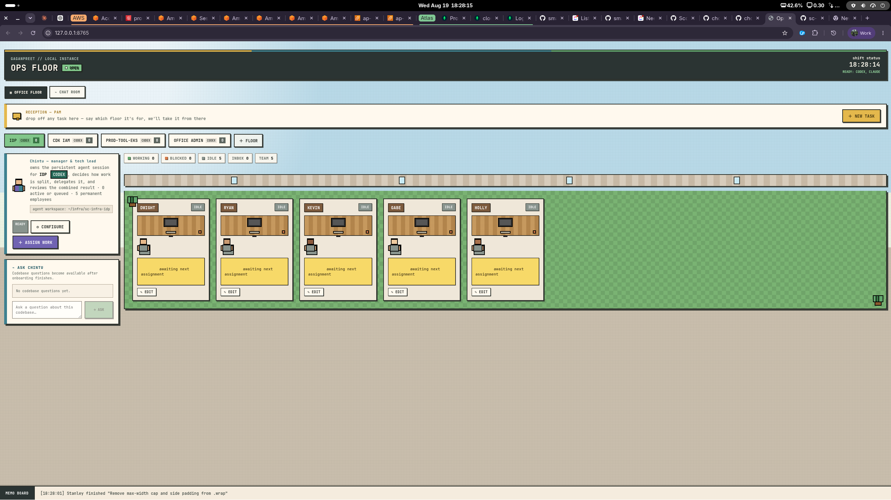

# The Office

The Office is a local-first platform for coordinating software work across one or more Git repositories with Claude Code and Codex.

It gives every onboarded project a persistent Manager & Tech Lead, a reusable team of coding agents, repository-aware context, and a controlled path from task intake to reviewed code. Work stays on your computer: the service binds to `127.0.0.1`, uses your locally authenticated agent CLIs, and only operates on repositories you choose.



## What the platform does

- Onboards an existing Git repository, clones a remote repository, groups several repositories into one project floor, or creates a brand-new app from a refined text brief.
- Builds durable context about architecture, conventions, tests, risks, and important files before accepting implementation work.
- Routes a task to the correct project or projects through reception, then lets each project lead plan the work.
- Uses an optional Office-wide repository context folder to help reception identify affected repositories and propose missing floors for clone/onboarding.
- Accepts direct floor tasks with optional discussion; **Send it** carries the original notes, completed manager responses, and user follow-ups into task specifications and planning.
- Reuses persistent Claude Code or Codex sessions so project knowledge carries across questions, reports, and tasks.
- Delegates independent workstreams to a stable five-agent team while protecting overlapping repository paths.
- Captures live activity, logs, changed files, test results, token usage, and task history.
- Creates a recoverable Git checkpoint before implementation and retains an immutable completion snapshot.
- Presents the real working-tree diff for review, including selectable hunks, before anything is published.
- Runs a floor's app in an embedded live preview, streams its console, and provides a small OpenAPI-aware backend request tester.
- Converts every change requested from live preview into a floor employee task with ordinary checkpoints and review; preview never edits through a privileged direct-agent path.
- Keeps rejected edits local and allows a completed run to be restored to its pre-run checkpoint.
- Pushes a task branch and opens GitHub pull requests only after explicit confirmation.
- Stores floors, project context, conversations, runs, logs, and settings in a local SQLite database.

The Office also supports read-only codebase questions, implementation reports, Markdown specification trackers, repository file and Git tools, scoped command execution, lifecycle hooks, per-floor permissions, MCP servers, and Claude plugins.

## How work moves through The Office

```text
Task enters reception
        |
        v
Repository ownership is identified
        |
        v
Each Manager & Tech Lead plans its project work
        |
        v
One or more agents implement and verify changes
        |
        v
The combined diff and tests are reviewed
        |
        v
The user chooses whether to publish
        |
        v
One branch and pull request is created per changed repository
```

The lead coordinates and reviews rather than implementing directly. Cross-project work is split into repository-owned assignments, and floor leads can request targeted read-only context from each other before finalizing a plan.

## Requirements

- Python 3.10 or newer
- Git
- A modern browser
- At least one locally authenticated agent CLI:
  - [Claude Code](https://docs.anthropic.com/en/docs/claude-code)
  - [Codex CLI](https://github.com/openai/codex)
- GitHub CLI (`gh`), only when creating pull requests from The Office

The Python service has no third-party package dependencies. `requirements.txt` is intentionally empty apart from explanatory comments.

## Quick start

Clone or copy the repository, then run:

```sh
cd /path/to/office
python3 office_server.py
```

Open <http://127.0.0.1:8765>, select **+ floor**, and provide a local repository path or Git URL.

You can use a different port:

```sh
python3 office_server.py --port 9000
```

Do not open `office.html` as a `file://` page. Repository access, agent execution, persistence, Git operations, and publishing require the local Python service.

For a guided first run, see [Getting started](docs/getting-started.md).

## Assigning tasks and sharing repository context

For an onboarded floor, enter a task title and click **Send it** to queue work for its manager. **Discuss** is optional. If you discuss first, the completed conversation is included in the task context when you send it, along with any additional text still in the message field. A failed discussion does not prevent direct submission; agent execution errors still need to be resolved before implementation can proceed.

For cross-repository work, use reception. You can configure a shared knowledge folder under **More → Preferences → Repository context folder → Browse folders → Save**. This global setting persists across Office restarts. Clear the path and save to disable it.

The folder can contain your own Markdown, text, RST, YAML, or JSON documents describing repository locations, owners, dependencies, and conventions. Reception uses bounded, task-relevant excerpts to inform routing. Missing repositories are proposed through the existing floor setup screen, where you choose local paths or clone destinations. The original task waits for onboarding and is then routed again. If the context is absent, unavailable, or irrelevant, reception uses normal floor allocation. No organization-specific knowledge is bundled; selected excerpts are sent to your configured agent.

All Codex workflows default to `gpt-6-astra`, including resumed sessions. Use a Codex CLI version that supports Astra; an older executable can reject the model even when discussion or task setup works. `TASK_OFFICE_CODEX_MODEL` overrides the model Office-wide. Claude-configured floors continue to use Claude. See [Agent configuration](docs/configuration.md#agent-configuration).

If a submitted task fails during planning, inspect its profile log for the provider error. The server now surfaces structured agent errors instead of only an exit code. After updating the backend, restart Office and retry the existing failed task; its saved discussion context is retained.

## Documentation

The repository includes task-oriented documentation for users and operators:

- [Documentation home](docs/README.md) — choose the right guide.
- [Getting started](docs/getting-started.md) — install, start, and onboard your first project.
- [Platform concepts and workflows](docs/platform-guide.md) — floors, leads, agents, routing, reports, specs, review, and publishing.
- [Configuration reference](docs/configuration.md) — CLI discovery, data storage, history, models, hooks, permissions, MCP, and plugins.
- [Operations and security](docs/operations.md) — persistence, backups, recovery, troubleshooting, and the deployment boundary.

## Architecture

The platform is intentionally build-free and runs as a personal local service:

```text
Browser client
    |
    v
Python HTTP service ---- SQLite state and run history
    |          |
    |          +---- Git repositories and checkpoints
    |
    +---- Claude Code / Codex CLI processes
                     |
                     +---- optional MCP servers and Claude plugins
```

Key source areas:

```text
office_server.py   Local HTTP service and agent-run orchestration
office_agents.py   Claude Code and Codex adapters
office_backend/    Persistence, Git, repository, and HTTP modules
office.html        Browser application shell and shared workflow state
ui/                Build-free UI modules
the-office-plugins/ Bundled Claude plugin marketplace
test_office_server.py
                   Persistence, Git, agent, and HTTP behavior tests
docs/              User and operator documentation
```

## Development

Run the test suite with:

```sh
python3 -m unittest -v test_office_server.py
```

With Node.js available, also verify the discussion-to-task context handoff:

```sh
node test_task_context.cjs
```

The service is implemented with the Python standard library and plain browser modules, so no package installation or asset build step is required.

## Security boundary

The Office is a personal local application, not a multi-user web service. It has no application-level authentication, and agent processes inherit the permissions of the user running the server. Do not expose it directly to a LAN or the public internet.

See [Operations and security](docs/operations.md) before using it with sensitive repositories or extending its deployment model.
